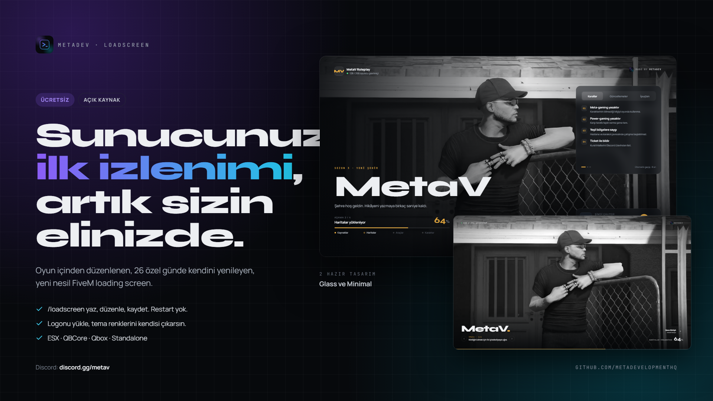
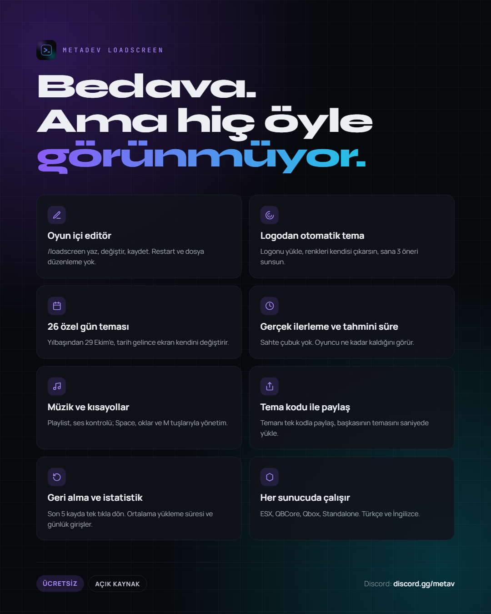
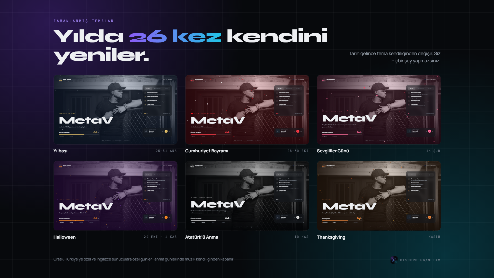

<div align="center">



# MetaDev Loadscreen

**The first screen players see on your server. Redesigned.**

A free, open source FiveM loading screen with an in-game editor and 26 scheduled holiday themes.

[](LICENSE)
[](#installation)
[](#frameworks)
[](https://discord.gg/metav)

**English** · [Türkçe](README.tr.md)

</div>

---

## Features

### In-game editor
Type `/loadscreen`, the editor opens. Change colors, fonts, texts, music and background with a live preview. Press **Save** and the next player who connects sees the new screen. No restart, no file editing.

### Theme from your logo
Upload your logo. The editor extracts its colors and suggests 3 themes that match your brand.

### 26 scheduled themes
Snow at New Year, hearts on Valentine's Day, embers on Halloween, autumn leaves on Thanksgiving. On remembrance days the screen turns grayscale and the music turns itself off. Turkish and English servers each get their own holidays. You don't do anything; the theme changes when the date comes.

### Built for players
- Real loading progress, not a fake bar
- Estimated time left, based on each player's previous loads
- Music player with playlist and volume control
- Rules, updates and tips cards
- Keyboard shortcuts: `Space` music, `←` `→` cards, `M` mute
- Live player count

### Built for server owners
- **Theme codes:** Share your theme as a single code, import someone else's in seconds
- **Undo:** Roll back to any of your last 5 saves with one click
- **Statistics:** Average load time and daily joins
- **2 designs:** Glass and Minimal

## Screenshots





## Installation

1. Download the [latest release](../../releases/latest) and extract it into your `resources` folder.
2. Make sure the folder is named `metadev-loadscreen`.
3. Add this line to your `server.cfg`:
   ```cfg
   ensure metadev-loadscreen
   ```
4. Give the editor permission to your admins:
   ```cfg
   add_ace group.admin metadev.loadscreen.admin allow
   ```
5. Restart your server. Done.

> Only one loading screen can be active at a time. Remove or stop any other loading screen resource.

## Configuration

Everything can be changed from the in-game editor. For the few server-level settings, open `config.lua`:

```lua
Config.Locale     = 'en'                -- 'en' or 'tr'
Config.Timezone   = 'Europe/Istanbul'   -- used for scheduled themes
Config.Framework  = 'auto'              -- 'auto', 'esx', 'qb', 'qbox', 'standalone'
Config.ShowCredit = true                -- small MetaDev credit in the corner
```

### Media
- Put images, videos and music in `web/media/`, or use `https://` links.
- Use **WebM** for video backgrounds. FiveM's browser may not play H.264 MP4 reliably.
- Don't use Discord CDN links; they expire.

## Scheduled themes

Shared days appear in both languages. Language-specific days appear only when that language is selected in `Config.Locale`.

| Shared | Turkish only | English only |
|---|---|---|
| New Year (Dec 25–31) | Mar 18 Çanakkale Victory & Martyrs' Day | St. Patrick's Day (Mar 17) |
| Valentine's Day (Feb 14) | Apr 23 National Sovereignty & Children's Day | Easter |
| International Women's Day (Mar 8) | May 1 Labour & Solidarity Day | Memorial Day |
| April Fools' Day (Apr 1) | May 19 Youth & Sports Day | Independence Day (Jul 4) |
| Mother's Day | Jul 15 Democracy & National Unity Day | Labor Day |
| Father's Day | Aug 30 Victory Day | Veterans Day (Nov 11) |
| Sep 17 Community Day | Oct 29 Republic Day | Thanksgiving |
| Halloween (Oct 24 – Nov 1) | Nov 10 Atatürk Remembrance Day | Christmas (Dec 18–24) |
| Black Friday | Nov 24 Teachers' Day | |

- Each day can be turned off or its message changed from the editor.
- If two themes fall on the same day, national and remembrance days take priority.
- Moving dates (Easter, Mother's Day, Thanksgiving…) are calculated automatically every year.
- To test a theme without waiting, set `Config.Debug.ForceDate = '2026-10-29'`.

## Frameworks

Works standalone. If `Config.Framework` is `auto`, ESX, QBCore and Qbox are detected automatically. The framework is only used to check admin groups; nothing else depends on it.

## FAQ

**Is it really free?**
Yes. Free and open source under the MIT license.

**Can I remove the MetaDev credit?**
You can turn it off with `Config.ShowCredit = false`. We'd appreciate it if you kept it; it's how we can keep releasing free resources.

**Do I need to restart after editing?**
No. Changes made in the editor apply to the next player who connects.

**The video background doesn't play.**
Convert it to WebM. FiveM's browser may not support H.264 MP4.

## Support

Questions, bugs and theme sharing: **[discord.gg/metav](https://discord.gg/metav)**

Found a bug? [Open an issue](../../issues).

## License

[MIT](LICENSE) © MetaDev
