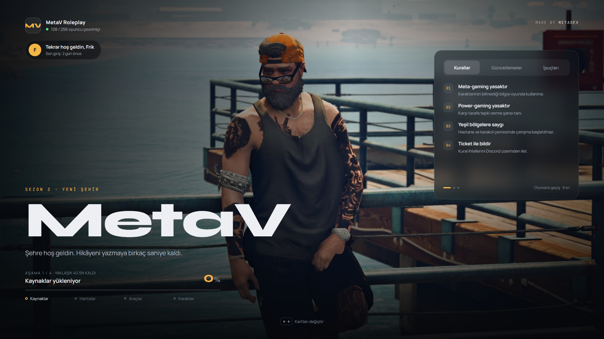
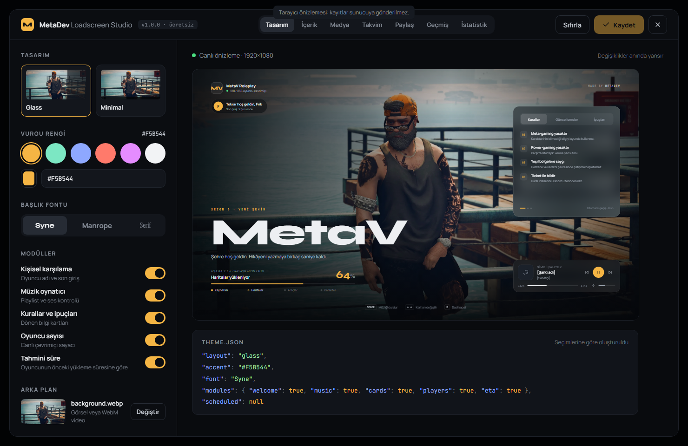
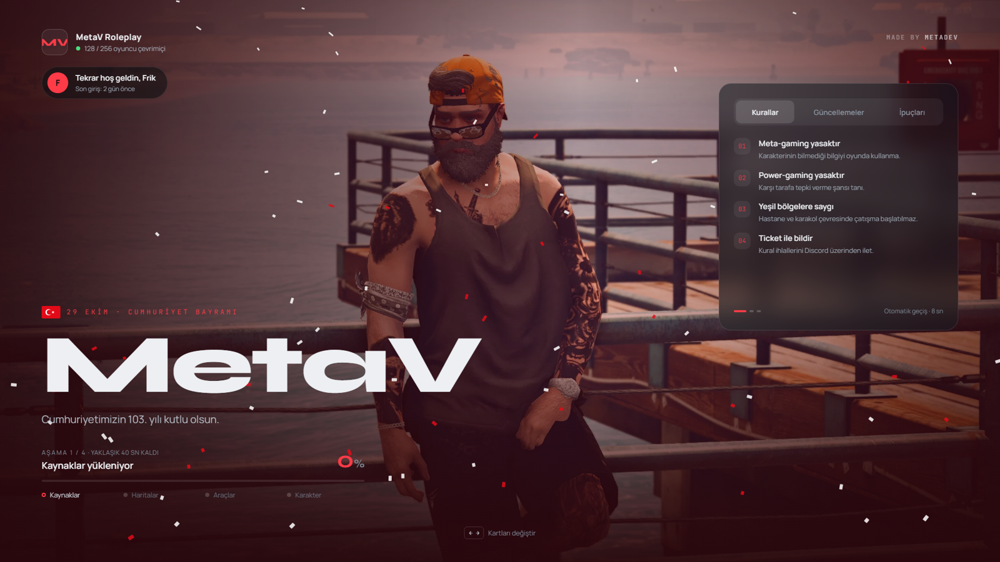

# MetaDev Loadscreen

Ücretsiz ve açık kaynak FiveM loading screen'i. Oyun içi tema editörü, gerçek yükleme ilerlemesi, oyuncuya özel tahmini süre ve Türkiye ile ABD'nin özel günlerine göre kendiliğinden değişen zamanlanmış temalar içerir.

**[English below](#english)** · Discord: `discord.gg/metadev`

<!-- Ekran görüntüleri: docs/screenshots/ içine koyup aşağıdaki yolları güncelle. -->
| Glass | Minimal |
|---|---|
|  |  |
| **Tema editörü** | **29 Ekim** |
|  |  |

## Özellikler

- **İki tasarım:** Glass (cam kartlar, büyük başlık) ve Minimal (açık fotoğraf, tek satır bilgi).
- **Gerçek ilerleme:** FiveM'in yükleme olaylarından hesaplanır (Kaynaklar → Haritalar → Araçlar → Karakter). Sahte ilerleme yoktur, yüzde asla geri gitmez.
- **Tahmini süre:** Sunucu her oyuncunun son yükleme süresini hatırlar. Kaydı olmayan oyuncuya sunucu ortalaması gösterilir. Kalan süre gerçek ilerlemeye göre güncellenir.
- **Müzik çalar:** Playlist, ileri/geri, ses ayarı, her geçişte yumuşak fade.
- **Kurallar, güncellemeler ve ipuçları:** Kendiliğinden dönen kartlar, klavye kısayolları (`Space`, `← →`, `M`).
- **Kişisel karşılama:** "Tekrar hoş geldin, Frik · Son giriş: 2 gün önce".
- **Oyun içi tema editörü (`/loadscreen`):** Önizleme loading screen ile aynı kodla çizildiği için ekranda birebir aynı görünür. Kaydedince restart gerekmeden bir sonraki bağlantıda uygulanır.
- **Logodan otomatik renk:** Logodaki baskın renklerden koyu zeminde okunabilir 3 vurgu rengi önerir.
- **Tema kodu paylaşımı:** `MDLS1:…` koduyla temanı başka sunucularla paylaşabilirsin.
- **Geri alma:** Son 5 kayıt saklanır, tek tıkla geri dönülür.
- **İstatistikler:** Ortalama, en hızlı ve en yavaş yükleme ile son 7 günün girişleri.
- **26 zamanlanmış tema:** Cumhuriyet Bayramı, 10 Kasım, Yılbaşı, Halloween, Thanksgiving ve diğerleri. Her biri kendi efekti, rengi ve dinamik mesajıyla gelir ("Cumhuriyetimizin 103. yılı kutlu olsun").
- **Hafif:** Build adımı yok, framework yok, dış bağlantı yok. Vanilla HTML, CSS ve JS (ES modules). Efektler sadece CSS animasyonudur.
- **Standalone çalışır.** ESX, QBCore ve Qbox otomatik algılanır ama sadece admin yetkisi kontrolünde kullanılır.

## Hızlı kurulum

1. Klasörü `resources/` içine `metadev-loadscreen` adıyla koy.
2. `server.cfg` dosyasına ekle:
   ```cfg
   ensure metadev-loadscreen
   add_ace group.admin metadev.loadscreen.admin allow
   ```
3. Sunucuyu başlat, oyuna gir, `/loadscreen` yaz.

Başka bir loading screen kullanıyorsan onu kaldır (aynı anda yalnızca bir `loadscreen` çalışabilir).

## Dokümantasyon

| Türkçe | English |
|---|---|
| [Kurulum](docs/tr/kurulum.md) | [Installation](docs/en/installation.md) |
| [Yapılandırma](docs/tr/yapilandirma.md) | [Configuration](docs/en/configuration.md) |
| [Tema editörü](docs/tr/editor.md) | [Theme editor](docs/en/editor.md) |
| [Zamanlanmış temalar](docs/tr/zamanlanmis-temalar.md) | [Scheduled themes](docs/en/scheduled-themes.md) |
| [SSS](docs/tr/sss.md) | [FAQ](docs/en/faq.md) |

## Medya hakkında önemli notlar

- **Video arka plan için WebM kullan.** FiveM'in tarayıcısı (CEF) H.264 MP4'ü güvenilir şekilde oynatamayabilir.
- **Discord CDN linklerini kullanma.** Bu linkler süreli olduğu için bir süre sonra arka planın ve müziğin kaybolur. Dosyayı `web/media/` içine koy ya da kalıcı bir `https://` adresi kullan.
- Yerel dosyalar `web/media/` içinde durur ve editörde `media/dosya-adi.webp` şeklinde girilir. Yeni eklenen dosyalar oyunculara resource yeniden başlatılınca gider.

## Teknik kararlar

Belirsiz kalan noktalarda verilen kararlar:

| Konu | Karar | Neden |
|---|---|---|
| Ölçekleme | Tasarım 1920×1080 mantıksal sahnede çizilir ve `min(genişlik/1920, yükseklik/1080)` oranıyla ölçeklenir. Öğeler köşelere sabitlidir. | Her çözünürlükte tasarım birebir korunur, ultrawide ekranda öğeler köşelerinde kalır. |
| Saat dilimi | Sunucu UTC zamanını ve `Config.Timezone` değerini gönderir, tarih tarayıcıda `Intl` ile hesaplanır. İstatistiklerin gün sınırı için `Config.UtcOffset` kullanılır. | Lua'da IANA saat dilimi veritabanı yok. |
| Medya yükleme | Editörde dosya yükleme yok. Yerel yol veya `https://` adresi girilir. | FiveM, resource dosyalarını başlatma anında paketler. Çalışırken eklenen dosya restart olmadan oyunculara ulaşmaz. |
| Oyuncu verisi | `stats.json` license değil, license'ın hash'ini saklar. | Tahmin için oyuncuyu ayırt etmek yeterli. Ham kimlik diske yazılmaz. |
| Geçmiş | 5 sabit slot ve `index.json` dosyası. | Dosya silmeye gerek kalmaz, `SaveResourceFile` ile her şey yapılabilir. |
| Arka plan | Varsayılan görsel PNG yerine WebP (4,5 MB → 190 KB). | Loading screen ilk indirilen şey olduğu için boyut önemli. |
| Kişisel karşılama | Editör tasarımındaki "Kişisel karşılama" modülü eklendi. | Sunucu bu veriyi tahmini süre için zaten tutuyor. |

## Klasör yapısı

```
metadev-loadscreen/
├─ fxmanifest.lua, config.lua
├─ locales/        tr.lua, en.lua (sunucu mesajları) · tr.json, en.json (arayüz)
├─ shared/         locale.lua
├─ server/         main.lua, theme_store.lua, stats.lua, permissions.lua, bridge/
├─ client/         main.lua (kapanış), editor.lua (editör köprüsü)
├─ web/
│  ├─ loadscreen.html, editor.html
│  ├─ css/         stage.css (ortak tasarım), loadscreen.css, editor.css, fonts.css
│  ├─ js/          renderer.js (ortak çizim), calendar.js, themes.js, effects.js,
│  │               progress.js, music.js, i18n.js, loadscreen.js, editor.js,
│  │               themecode.js, logocolors.js, vendor/lz-string.js
│  ├─ fonts/       yerel fontlar (OFL)
│  └─ media/       arka plan, logo, müzik
├─ data/           theme.json, history/, stats.json (sunucu yazar)
└─ docs/
```

Takvim mantığı testli: `node web/js/calendar.test.mjs`

## İmza

Loading screen'in köşesinde soluk bir **MADE BY METADEV** yazısı bulunur. `Config.ShowCredit = false` ile kapatılabilir. Ama açık bırakırsan bize çok yardımcı olursun: diğer sunucu sahipleri bu ücretsiz kaynağı böyle buluyor. Kodu değiştirip yeniden dağıtırsan lütfen MetaDev imzasını koru.

## Lisans

[MIT](LICENSE) © 2026 MetaDev. Fontlar SIL Open Font License 1.1, lz-string MIT lisanslıdır.

---

## English

A free, open-source FiveM loading screen with an in-game theme editor, real loading progress, a per-player time estimate, and scheduled themes that switch on their own for Turkish and US holidays.

**Install:** drop the folder into `resources/` as `metadev-loadscreen`, then add to `server.cfg`:

```cfg
ensure metadev-loadscreen
add_ace group.admin metadev.loadscreen.admin allow
```

Join the server and type `/loadscreen` to open the editor. Set `Config.Locale = 'en'` in `config.lua` for English.

**Highlights:** two layouts (Glass, Minimal) · real progress from FiveM's loading events · per-player ETA · playlist with fades · rotating rule/update/tip cards · keyboard shortcuts · live editor whose preview uses the same renderer as the real screen · accent colors from your logo · `MDLS1:` theme codes · undo history · load statistics · 26 scheduled themes · no build step and no external requests.

**Media:** use **WebM** for video backgrounds (FiveM's CEF may not play H.264 MP4), and don't use Discord CDN links, because they expire.

Read more in [docs/en](docs/en/installation.md). Please keep the MetaDev credit if you redistribute. MIT licensed.
